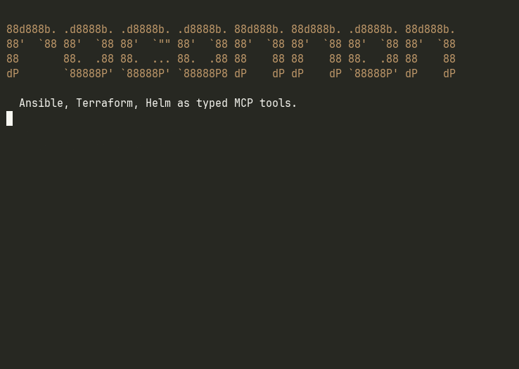

# Rocannon

<p align="center">
  
</p>

Rocannon registers Ansible modules, Terraform resources, Terraform registry
modules, and Helm charts as typed MCP tools. One server, three catalogs, every
operation auto-discovered from upstream.



## What it is

Rocannon is an MCP server. It reads `ansible-doc`, `tofu providers schema`, and
`helm show chart` at startup and builds typed function definitions for every
operation in the catalogs you load. An MCP client (Claude Desktop, Cursor,
mcphost, any custom agent) sees them as ordinary tools with required arguments,
types, and descriptions.

Why typed tools instead of code generation:

- LLMs cannot invent argument names that the schema rejects.
- Required arguments are enforced by Pydantic before the call is dispatched.
- Results come back as structured JSON, not parsed text.
- The same surface works for Ansible modules, Terraform resources, Terraform
  registry modules, and Helm charts. No per-operation glue code.

It also works without an LLM. Rocannon ships a REPL that calls the same MCP
server in-process. Tab completion, structured output, history.

## Install

```bash
# Core install (no cannons enabled, useful for `rocannon doctor`):
pip install rocannon

# Pick the cannons you want:
pip install 'rocannon[ansible]'         # adds ansible-core + ansible-runner
pip install 'rocannon[terraform]'       # adds python-hcl2 (needs `tofu` on PATH)
pip install 'rocannon[helm]'            # needs `helm` on PATH
pip install 'rocannon[ansible,terraform,helm]'
pip install 'rocannon[all]'             # everything, plus litellm + otel
```

System binaries (`tofu`, `helm`, `ansible-doc`, `ansible-runner`) are detected
at startup. If one is missing, `rocannon` exits with the install command for
your platform.

## Quickstart

Runs against localhost. No SSH, no cloud, no Kubernetes.

```bash
# 1. From the rocannon checkout:
cd examples/quickstart

# 2. Check the toolchain is happy
rocannon mcp doctor --profile profile.yml

# 3. Start the operator REPL
rocannon repl --profile profile.yml
```

Inside the REPL:

```
rocannon> .target localhost
rocannon> ping
rocannon> command cmd="uptime"
rocannon> tf_random_string instance=demo length=16 special=false
rocannon> .history
rocannon> .save quickstart_session
rocannon> .exit
```

After `.save`, the session is persisted to `.rocannon/playbooks/quickstart_session.yml`
and loads back as an MCP prompt next time the server starts.

The same profile also works as an MCP server:

```bash
rocannon mcp serve --profile profile.yml
```

## CLI

```
rocannon mcp serve     start the MCP server (stdio or http transport)
rocannon mcp doctor    construct the server in-process and list its tools/resources/prompts
rocannon repl          interactive shell, drives the in-process MCP server
rocannon run           call one module ad-hoc (no MCP server, no REPL)
rocannon doctor        general system health (binaries, env vars, inventory parses)
rocannon doc <module>  print parsed schema for an Ansible module
rocannon search <q>    grep Ansible modules by name or description
rocannon ls            list hosts/groups/modules from a profile
rocannon playbook      list/show/run saved playbooks
```

Run `rocannon --help` or `rocannon <command> --help` for details.

## Profile examples

A profile is a YAML file declaring which cannons to load and what they should
expose. Profiles can mix any combination of the three cannons.

Ansible only:

```yaml
inventories:
  - ./hosts
modules:
  - ansible.builtin
  - community.general
  - ibm.ibm_zos_core
ansible_cfg: ./ansible.cfg          # optional
vault_password_file: ~/.vault_pass  # optional
```

Terraform only, multi-provider, plus a registry module:

```yaml
terraform:
  workspace: ./tf-work
  providers:
    docker:
      source: kreuzwerker/docker
      version: "~> 3.0"
    "null":                          # quote: unquoted `null` parses to None
      source: hashicorp/null
      version: "~> 3.2"
  modules:
    - source: cloudposse/label/null
      version: "0.25.0"
```

Helm only:

```yaml
helm:
  charts:
    - name: bitnami/nginx
      version: "21.0.6"
    - name: bitnami/redis
      version: "21.0.6"
  default_namespace: rocannon-demo
```

All three:

```yaml
inventories: [./hosts]
modules: [ansible.builtin.ping, ansible.builtin.command]

terraform:
  workspace: ./tf-work
  providers:
    docker: { source: kreuzwerker/docker, version: "~> 3.0" }

helm:
  charts:
    - { name: bitnami/nginx, version: "21.0.6" }
```

## MCP clients

Rocannon speaks the standard MCP protocol over stdio or HTTP. Any MCP client
works. A working `.mcp.json` ships at the repo root; running `claude` from a
checkout auto-discovers it.

Per-client config snippets (all targeting the quickstart profile) live in
[`examples/clients/`](examples/clients/):

| Client | Where the config goes |
|---|---|
| **Claude Code** (CLI) | `.mcp.json` at the project root (shipped), or `claude mcp add ...` |
| **Claude Desktop** | macOS: `~/Library/Application Support/Claude/claude_desktop_config.json` |
| **Cursor** | `.cursor/mcp.json` (project) or `~/.cursor/mcp.json` (global) |
| **mcphost** (terminal) | `~/.mcphost.yml` or `--config <path>` |
| **IBM Bob** (Shell + IDE) | `.bob/mcp.json` (project) or `~/.bob/mcp_settings.json` (global) |

All share the standard `mcpServers` envelope:

```json
{
  "mcpServers": {
    "rocannon": {
      "command": "uv",
      "args": [
        "run", "--directory", "/path/to/rocannon",
        "rocannon", "mcp", "serve",
        "--profile", "/path/to/rocannon/examples/quickstart/profile.yml"
      ]
    }
  }
}
```

Replace `/path/to/rocannon` with your checkout path. Use
`ROCANNON_DATA_DIR=<some-dir>` in the `env` field if you want `save_playbook`
to write outside the process CWD.

### Verify any client can spawn rocannon

```bash
claude mcp get rocannon          # Claude Code
mcphost --config examples/clients/mcphost.json --model ollama:granite4.1:3b \
  -p "list every tool you have"  # mcphost
```

Both should report the server connected and list typed tools from each loaded
cannon.

## REPL (non-AI operator mode)

The REPL is a plain shell for the same MCP tools an LLM would see. Useful when
you want to call modules directly without an LLM in the loop.

```
rocannon> .help                    show commands
rocannon> .target webhosts         set a default target (Ansible only)
rocannon> .inventory               list hosts and groups
rocannon> .modules                 list every registered tool
rocannon> .doc copy                show the schema for ansible.builtin.copy
rocannon> .history                 recent calls this session
rocannon> .save my_runbook         persist this session as a playbook
rocannon> .ai <prompt>             optional: drive the same tools via litellm
rocannon> .exit                    leave (also ctrl-d)
```

Module calls use shell-style key=value syntax with shlex quoting:

```
rocannon> ansible.builtin.command target=h1 cmd="systemctl status nginx"
rocannon> tf_docker_image instance=alpine name=alpine:3.20
rocannon> helm_install_bitnami_nginx release_name=web namespace=prod values='{"replicaCount": 2}'
```

Short names resolve to FQCN, preferring `ansible.builtin`:

```
rocannon> ping target=h1            # → ansible.builtin.ping
```

The `.ai` mode is optional and off by default. It uses litellm so the backend
is up to the operator (Ollama, OpenAI, Anthropic, watsonx, vLLM, etc., picked
via `ROCANNON_AI_MODEL`).

## Cannons (the plugin model)

A *cannon* is the registration layer for one upstream catalog. Each cannon
reflects schemas, builds typed function signatures, and registers them on the
FastMCP server.

| Cannon | Catalog source | Tool name pattern |
|---|---|---|
| `AnsibleCannon` | `ansible-doc -j <module>` | `ansible.builtin.copy`, `community.general.docker_container` |
| `TerraformCannon` | `tofu providers schema -json` + `variables.tf` | `tf_docker_container`, `tf_module_aws_vpc` |
| `HelmCannon` | `helm show chart` | `helm_install_bitnami_nginx` |

All cannons share one set of cross-cutting services: audit middleware,
correlation IDs, response size limits, retry on transient errors, history
buffer for save/replay.

The `Cannon` base class (`rocannon.cannons.Cannon`) is the extension point.
Adding a fourth cannon means implementing one `register(mcp, services)` method.

## Saved playbooks (cross-cannon)

Two tools register at the server level regardless of which cannons are loaded:

- `save_playbook(name, description, steps, overwrite)` writes a playbook YAML
  to `$ROCANNON_DATA_DIR/.rocannon/playbooks/<name>.yml`.
- `commit_session(name, description, since)` materializes this session's
  successful tool calls into a playbook.

On the next server start, every saved playbook becomes an MCP prompt named
`playbook_<name>`. Step format is `{tool, args}`, so a playbook can mix
Ansible, Terraform, and Helm calls.

If the upstream catalog changes between save and load (provider upgrades,
module rename), the playbook is skipped with a warning, not registered as a
half-broken prompt.

## Development

```bash
git clone <repo> rocannon
cd rocannon
uv sync                            # installs all dev deps
uv run pytest                      # unit tests
uv run pytest -m integration       # opt-in: real docker, kind, tofu, helm
uv run ruff check
uv run mypy src/rocannon
```

The integration suite is opt-in because it spins up real containers and talks
to a local kind cluster. Prereqs (any missing auto-skips the test):

- Docker daemon reachable
- `tofu` and `helm` on PATH
- A kind cluster named `rocannon-test`

## The name

Ursula K. Le Guin coined the word "ansible" in her 1966 novel *Rocannon's
World*. Rocannon was the title character. Calling the engines "cannons" is a
small pun on the name.

The gryphon at the top is a nod to the Windsteeds that Rocannon and his
companions ride in the novel.

## Credits

- Gryphon icon: [Gryphon by Aleksei Kovalenko from Noun Project](https://thenounproject.com/icon/gryphon-7096619/) (CC BY 3.0).
